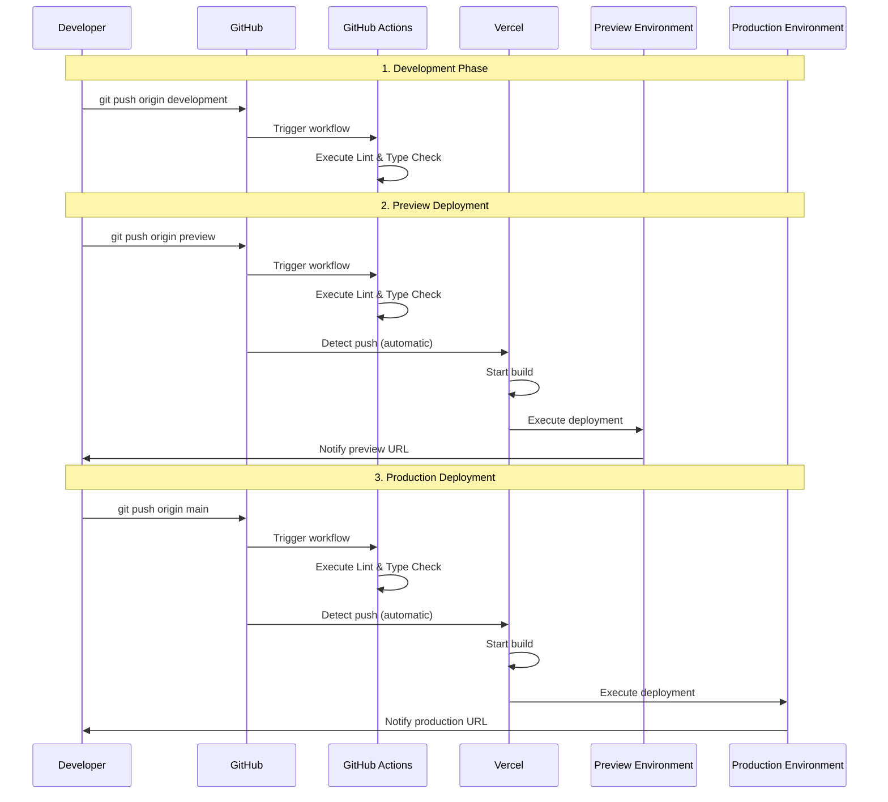

# CI/CD Pipeline

This project uses a CI/CD pipeline integrated with GitHub and Vercel.

## Overview

The current CI/CD operates through two mechanisms:

1. **Vercel Automatic Deployment** (Primary): Directly integrated with GitHub repository, automatically detects pushes and deploys
2. **GitHub Actions** (Supporting): Executes Lint and Type Check (deployment jobs are currently disabled)

## CI/CD Flow Diagram

```mermaid
graph TB
    subgraph "Development Phase"
        Dev[Developer]
        DevBranch[development branch]
        Dev -->|git push| DevBranch
    end
    
    subgraph "GitHub"
        DevBranch -->|push| GitHub[GitHub Repository]
        PreviewBranch[preview branch]
        MainBranch[main branch]
        GitHub -->|merge| PreviewBranch
        PreviewBranch -->|merge| MainBranch
    end
    
    subgraph "GitHub Actions"
        GitHub -->|trigger| GHA[GitHub Actions Workflow]
        GHA -->|execute| Lint[Lint & Type Check]
        Lint -->|result| Status[Status Check]
    end
    
    subgraph "Vercel Automatic Deployment"
        PreviewBranch -->|detect push| VercelPreview[Vercel Preview Environment]
        MainBranch -->|detect push| VercelProd[Vercel Production Environment]
        
        VercelPreview -->|build| BuildPreview[Preview Build]
        VercelProd -->|build| BuildProd[Production Build]
        
        BuildPreview -->|deploy| PreviewURL[Preview URL]
        BuildProd -->|deploy| ProdURL[Production URL]
    end
    
    subgraph "Environment Configuration"
        PreviewURL -->|env vars| PreviewEnv[Preview Environment Variables]
        ProdURL -->|env vars| ProdEnv[Production Environment Variables]
    end
    
    style DevBranch fill:#e1f5ff
    style PreviewBranch fill:#fff4e1
    style MainBranch fill:#ffe1e1
    style VercelPreview fill:#e1ffe1
    style VercelProd fill:#ffe1e1
    style PreviewURL fill:#fff4e1
    style ProdURL fill:#ffe1e1
```

## Detailed Deployment Flow



## Branch Strategy

```mermaid
gitgraph
    commit id: "Initial commit"
    branch development
    checkout development
    commit id: "Feature development"
    commit id: "Bug fix"
    branch preview
    checkout preview
    merge development
    commit id: "Preview preparation"
    branch main
    checkout main
    merge preview
    commit id: "Production release"
    checkout development
    commit id: "Next feature development"
```

## Current Configuration Status

### ✅ Enabled Features

1. **Vercel Automatic Deployment**
   - Push to `main` branch → Automatic deployment to Production environment
   - Push to `preview` branch → Automatic deployment to Preview environment
   - Push to `development` branch → No deployment (disabled in configuration)

2. **GitHub Actions**
   - Executes Lint & Type Check on all pushes and PRs
   - Uses Node.js 22 and Bun 1.2.19

### ⚠️ Disabled Features

1. **Deployment via GitHub Actions**
   - Deployment jobs are commented out
   - Reason: GitHub Secrets (`VERCEL_TOKEN`, `VERCEL_ORG_ID`, `VERCEL_PROJECT_ID`) are not configured
   - Not required since Vercel automatic deployment is currently functioning

## Configuration Files

### 1. Vercel Configuration (`vercel.json`)

```json
{
  "git": {
    "deploymentEnabled": {
      "main": true,        // ✅ Production deployment enabled
      "preview": true,     // ✅ Preview deployment enabled
      "development": false // ❌ Development branch disabled
    }
  }
}
```

### 2. GitHub Actions (`.github/workflows/deployment.yml`)

- **Enabled**: Lint & Type Check job
- **Disabled**: Deployment jobs (commented out)

### 3. Build Configuration

- **Node.js**: 22
- **Package Manager**: Bun 1.2.19
- **Build Command**: `bun run build`
- **Install Command**: `bun install --frozen-lockfile`

## Deployment Triggers

| Branch | Trigger | Deployment Target | Status |
|--------|---------|-------------------|--------|
| `development` | push | None | ❌ Disabled |
| `preview` | push | Preview Environment | ✅ Enabled |
| `main` | push | Production Environment | ✅ Enabled |
| All | push/PR | GitHub Actions (Lint/Type Check) | ✅ Enabled |

## Environment Variables

The following environment variables must be configured for each environment:

### Preview Environment
- `DATABASE_URL`
- `PAYLOAD_SECRET`
- `BLOB_READ_WRITE_TOKEN`
- `NEXT_PUBLIC_VERCEL_ENV=preview`
- `SENTRY_DSN`
- Other required environment variables

### Production Environment
- `DATABASE_URL`
- `PAYLOAD_SECRET`
- `BLOB_READ_WRITE_TOKEN`
- `NEXT_PUBLIC_VERCEL_ENV=production`
- `SENTRY_DSN`
- Other required environment variables

## Deployment Process

### 1. Deploy to Preview Environment

```bash
# Merge from development branch to preview branch
git checkout preview
git merge development
git push origin preview
```

**Process executed**:
1. GitHub Actions runs Lint & Type Check
2. Vercel detects the push
3. Vercel starts the build
4. Deploys to Preview environment
5. Preview URL is generated

### 2. Deploy to Production Environment

```bash
# Merge from preview branch to main branch
git checkout main
git merge preview
git push origin main
```

**Process executed**:
1. GitHub Actions runs Lint & Type Check
2. Vercel detects the push
3. Vercel starts the build
4. Deploys to Production environment
5. Published to production URL

## Monitoring

### Checking Deployment Status

1. **GitHub Actions**
   - Check in the repository's "Actions" tab
   - Review Lint & Type Check results

2. **Vercel Dashboard**
   - Check deployment history in Vercel dashboard
   - Review build logs and deployment logs

3. **Sentry**
   - Error tracking
   - Performance monitoring

## Troubleshooting

### Deployment Not Executing

1. **Check Vercel Git Integration**
   - Vercel Dashboard → Settings → Git
   - Verify repository is correctly connected

2. **Check Branch Configuration**
   - Verify `deploymentEnabled` settings in `vercel.json`
   - Confirm target branch is enabled

3. **Check Environment Variables**
   - Verify all required environment variables are set
   - Check environment variables in Vercel dashboard

### Build Errors

1. **Test Build Locally**
   ```bash
   bun run build
   ```

2. **Check Dependencies**
   ```bash
   bun install --frozen-lockfile
   ```

3. **Check Vercel Build Logs**
   - Review detailed error logs in Vercel dashboard

## Future Improvement Options

### Option 1: Enable GitHub Actions Deployment

To enable deployment via GitHub Actions:

1. Configure GitHub Secrets:
   - `VERCEL_TOKEN`
   - `VERCEL_ORG_ID`
   - `VERCEL_PROJECT_ID`

2. Uncomment deployment jobs in `.github/workflows/deployment.yml`

**Benefits**:
- Centralized deployment process management in GitHub Actions
- Ability to implement additional checks before deployment

**Drawbacks**:
- May overlap with current Vercel automatic deployment
- More complex configuration

### Option 2: Maintain Current Configuration

Continue using Vercel automatic deployment:

- Current configuration works without issues
- Simple and easy to manage
- GitHub Actions focuses only on Lint/Type Check

## Summary

The current CI/CD pipeline operates as follows:

1. **Development**: Develop on `development` branch → No deployment
2. **Preview**: Push to `preview` branch → Vercel automatically deploys to Preview environment
3. **Production**: Push to `main` branch → Vercel automatically deploys to Production environment
4. **Quality Checks**: GitHub Actions executes Lint & Type Check on all pushes/PRs

This configuration achieves a simple and efficient CI/CD pipeline.
