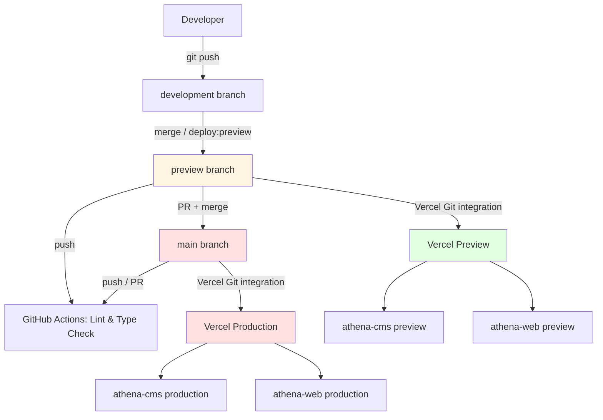

# CI/CD Pipeline

Athena ships through two cooperating mechanisms across **two Vercel projects**
(`apps/cms` and `apps/web`) built from one monorepo:

1. **Vercel Git integration** (deploys) — each project auto-builds and deploys its
   workspace on pushes to `preview` and `main`.
2. **GitHub Actions** (quality gate) — runs lint + type check. It does **not**
   deploy.

## Trigger Matrix

GitHub Actions (`.github/workflows/deployment.yml`) triggers on:

| Event | Runs Lint & Type Check? | Vercel deploy? |
|---|---|---|
| Push to `development` | ❌ (no GH Actions trigger) | ❌ None |
| Push to `preview` | ✅ | ✅ Preview (both apps) |
| Push to `main` | ✅ | ✅ Production (both apps) |
| PR targeting `main` | ✅ | Vercel preview deployment per PR |

> The workflow listens on `push: [main, preview]` and `pull_request: [main]`.
> Plain pushes to `development` do not start the GH Actions job; promote to
> `preview` (e.g. `bun run deploy:preview`) to exercise CI.

## CI/CD Flow


```mermaid
graph TB
    Dev[Developer] -->|git push| DevBranch[development branch]
    DevBranch -->|merge / deploy:preview| PreviewBranch[preview branch]
    PreviewBranch -->|PR + merge| MainBranch[main branch]

    PreviewBranch -->|push| GHA[GitHub Actions: Lint & Type Check]
    MainBranch -->|push / PR| GHA

    PreviewBranch -->|Vercel Git integration| VercelPreview[Vercel Preview]
    MainBranch -->|Vercel Git integration| VercelProd[Vercel Production]

    VercelPreview --> CMSPrev[athena-cms preview]
    VercelPreview --> WebPrev[athena-web preview]
    VercelProd --> CMSProd[athena-cms production]
    VercelProd --> WebProd[athena-web production]

    style PreviewBranch fill:#fff4e1
    style MainBranch fill:#ffe1e1
    style VercelPreview fill:#e1ffe1
    style VercelProd fill:#ffe1e1
```

## GitHub Actions Job

`.github/workflows/deployment.yml` defines a single **`lint`** job:

```yaml
on:
  push:
    branches: [main, preview]
  pull_request:
    branches: [main]

jobs:
  lint:                              # "Lint and Type Check"
    runs-on: ubuntu-latest
    steps:
      - uses: actions/checkout@v4
      - uses: actions/setup-node@v4   # node-version: 22.22.0
      - uses: oven-sh/setup-bun@v2    # bun-version: 1.3.5
      - run: bun install --frozen-lockfile
      - run: bun run lint             # ESLint (cms) + astro check (web)
      - run: bun run generate:types   # type generation acts as the type check
```

- **`bun run lint`** fans out across workspaces: ESLint in `apps/cms`, `astro
  check` in `apps/web`.
- **`bun run generate:types`** regenerates `packages/shared/src/payload-types.ts`;
  it doubles as the type check (a build error here fails CI).
- Deployment jobs (`deploy-preview` / `deploy-production`) remain **commented
  out** — deploys are handled by Vercel's Git integration, so the
  `VERCEL_TOKEN` / `VERCEL_ORG_ID` / `VERCEL_PROJECT_ID` secrets are not required.

## Build Configuration (Vercel)

There is **no `vercel.json`** in this repo — branch/deploy behavior is configured
in each Vercel project's dashboard. Two projects, one repo, split by **Root
Directory**:

| Project | Root Directory | Build Command | Install Command |
|---|---|---|---|
| `athena-cms` | `apps/cms` | `bun run build` → `next build --webpack` | `bun install --frozen-lockfile` |
| `athena-web` | `apps/web` | `bun run build` → `astro build` | `bun install --frozen-lockfile` |

- **Node.js**: 22 (pinned to `22.22.0` via `.nvmrc`)
- **Package manager**: Bun `1.3.5`
- Keep the CMS `--webpack` flag (Next 16 defaults to Turbopack, which ignores the
  load-bearing webpack alias). See
  [AGENTS.md → Build Configuration](../AGENTS.md#build-configuration-appscmsconfignextconfigmjs).

Full project setup: [DEPLOYMENT.md](./DEPLOYMENT.md).

## Environment Variables

Set per Vercel project (CMS vs web) and per environment (Preview / Production).
The CMS↔web shared secrets (`PREVIEW_SECRET`, `REVALIDATE_SECRET`) must be
identical across both projects. See
[DEPLOYMENT.md → Environment Variables](./DEPLOYMENT.md#environment-variables).

## Monitoring Deployment Status

1. **GitHub Actions** — repo "Actions" tab → "Lint and Type Check".
2. **Vercel** — each project's dashboard for build/deploy logs.
3. **Sentry** — runtime errors and performance.

## Troubleshooting

### Deployment not executing

- Check each Vercel project's *Settings → Git* connection and **Root Directory**.
- Confirm the branch is one Vercel deploys (`preview` / `main`).

### Build errors

```bash
bun run build:cms        # reproduce the CMS build
bun run build:web        # reproduce the Astro build
bun install --frozen-lockfile
```

Then review the failing project's Vercel build logs.

## Summary

1. **Development** — work on `development`; no deploy, no GH Actions run.
2. **Preview** — push `preview` (e.g. `bun run deploy:preview`); GH Actions
   lint/type-check + Vercel deploys both apps to Preview.
3. **Production** — PR `preview → main`; on merge Vercel deploys both apps to
   Production.
